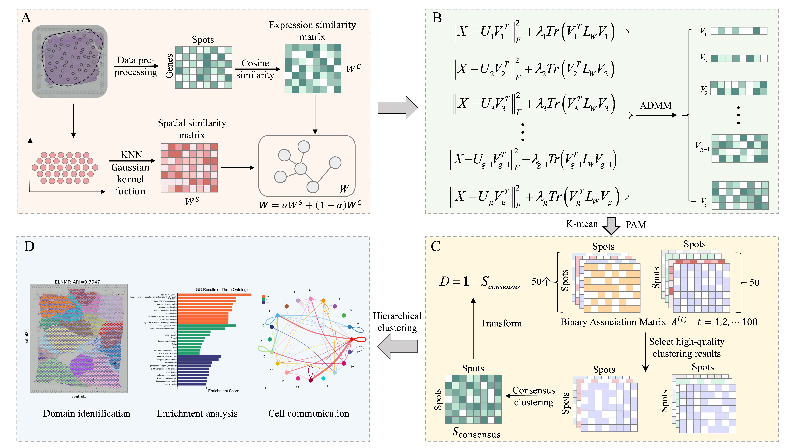

# ELNMF

ELNMF is an interpretable ensemble framework for spatial domain identification in spatial transcriptomics. It integrates multiple graph-regularized non-negative matrix factorization (NMF) solutions through quality-based partition filtering and consensus clustering.

## Overview

A hybrid graph encodes spatial proximity and gene expression similarity for NMF regularization. Candidate representations are generated across combinations of latent dimensions and graph-regularization strengths, and each representation is clustered independently using K-means and PAM. The resulting partitions are evaluated using a quality score that combines the Silhouette coefficient with the CHAOS score, both computed in the corresponding NMF latent space. Low-quality partitions are discarded, and the retained partitions are integrated through consensus clustering to reduce dependence on any single parameter configuration.

The main methodological contribution is the ensemble framework combining parameter-diverse NMF representations, quality-based partition filtering, and consensus integration. The hybrid graph serves as a supporting component for representation learning.


## Framework

<p align="center">
  
</p>

**Figure 1.** Schematic overview of ELNMF. (A) Hybrid graph construction integrates spatial proximity and gene expression similarity. (B) Graph-regularized NMF generates latent representations across multiple parameter configurations. (C) Each representation is clustered independently; the resulting base partitions are scored and filtered before their co-association matrices are averaged for consensus clustering. (D) The identified spatial domains and factorization outputs support downstream analyses, including functional enrichment and cell–cell communication analysis.

## Requirements

ELNMF is implemented in R. The original repository documentation reports R 4.5.2, whereas the manuscript's computational benchmarks report R 4.5.1. These are reported environments, not a verified minimum-version requirement. RStudio is optional. Package versions should be recorded separately for each reproduced experiment using `sessionInfo()`.

The current scripts use the following packages:

```r
required_packages <- c(
  "Seurat", "hdf5r", "ggplot2", "patchwork", "Matrix",
  "mclust", "aricode", "FNN", "dbscan", "igraph",
  "kernlab", "cluster"
)

missing_packages <- setdiff(required_packages, rownames(installed.packages()))
if (length(missing_packages) > 0) install.packages(missing_packages)
```

This installs available package versions; it does not recreate a version-locked manuscript environment. Additional dependencies may be needed for data conversion, comparison methods, and downstream analyses.

## Repository structure

| File or directory | Description |
|---|---|
| `main/ELNMF.R` | Main HBC analysis script, including preprocessing, hybrid graph construction, NMF representation generation, partition filtering, consensus clustering, and ARI/NMI evaluation |
| `main/hybrid graph.R` | Construction of the hybrid graph integrating spatial proximity and gene expression similarity |
| `main/NMF.R` | Graph-regularized NMF implementation for learning latent spot representations |
| `main/ensemble_clustering_filtered.R` | Helper functions for K-means, PAM, and binary co-association matrix construction; also defines `ensemble_clustering()` |
| `main/aggregative_indicator.R` | Calculation of the Silhouette coefficient, the implementation-specific CHAOS dispersion score, and the composite SC/CHAOS score in the NMF latent space |
| `main/filter_top.R` | Defines `ensemble_clustering_filtered()`, which loads candidate representations, generates and scores base partitions, applies quantile-based filtering, and constructs the consensus matrix |
| `Stability to random initialization on the MVC dataset.R` | MVC stability-analysis script using seeds 1–20, with per-run evaluation metrics, predicted labels, and summary statistics |
| `data/Human_Breast_Cancer/` | HBC input data and reference annotations |
| `data/MVC/` | MVC data files |
| `data/DLPFC/` | DLPFC data organized by tissue section |
| `ELNMF_overview.png` | Schematic illustration of the ELNMF framework |
| `README.md` | Method overview, parameter settings, and usage instructions |
| `LICENSE` | GNU General Public License v3.0 |


## Data preparation

The study evaluates human breast cancer (HBC), mouse visual cortex (MVC), and 12 human dorsolateral prefrontal cortex (DLPFC) sections.

The HBC script expects:

```text
data/Human_Breast_Cancer/
  filtered_feature_bc_matrix.h5
  metadata.tsv
  spatial/tissue_positions_list.csv
```

For HBC, the metadata must include `ID` and `ground_truth`. The script reads the legacy tissue-position file without a header and assigns the columns `barcode`, `in_tissue`, `array_row`, `array_col`, `imagerow`, and `imagecol`. Coordinate and metadata readers must match the actual input format.

The expression matrix uses genes as rows and spots as columns. All coordinate rows, labels, and latent representations must be aligned by spot barcode. The HBC benchmark script retains spots present in the expression matrix, marked as in-tissue, and having a non-missing reference label. It derives the target number of clusters from the reference labels. These benchmark choices should be distinguished from application to an unannotated dataset.

The current MVC directory contains H5AD/H5Seurat files. The HBC input reader is not a general MVC loading or conversion workflow.

## Parameter settings

The manuscript uses the following candidate grids:

```r
k_values <- seq(10, 28, by = 2)
lambda_hbc_dlpfc <- seq(40, 60, by = 5)
lambda_mvc <- seq(180, 200, by = 5)
```

Ten values of K and five values of lambda produce 50 NMF representations. Applying K-means and PAM to each representation produces 100 base partitions, provided all representations are available and successfully processed. K is the NMF latent dimension, not the number of final spatial domains.

### Settings reported in Supplementary Table S1

The table below records the current manuscript settings supplied by the authors. The computational-cost scripts preserve their original run settings; their documented differences from this table are listed in the experiment guide. 
| Dataset / section | tau | sigma | alpha | KNN | lambda candidates | q |
|---|---:|---:|---:|---:|---|---:|
| DLPFC 151507 | 0.87 | 1 | 0.8 | 22 | 40, 45, 50, 55, 60 | 0.79 |
| DLPFC 151508 | 0.87 | 1 | 0.8 | 17 | 40, 45, 50, 55, 60 | 0.55 |
| DLPFC 151509 | 0.87 | 1 | 0.8 | 10 | 40, 45, 50, 55, 60 | 0.35 |
| DLPFC 151510 | 0.95 | 1 | 0.8 | 8 | 40, 45, 50, 55, 60 | 0.30 |
| DLPFC 151669 | 0.91 | 1 | 0.8 | 6 | 40, 45, 50, 55, 60 | 0.93 |
| DLPFC 151670 | 0.89 | 1 | 0.8 | 7 | 40, 45, 50, 55, 60 | 0.46 |
| DLPFC 151671 | 0.97 | 1 | 0.8 | 14 | 40, 45, 50, 55, 60 | 0.19 |
| DLPFC 151672 | 0.93 | 1 | 0.8 | 24 | 40, 45, 50, 55, 60 | 0.74 |
| DLPFC 151673 | 0.90 | 1 | 0.8 | 8 | 40, 45, 50, 55, 60 | 0.34 |
| DLPFC 151674 | 0.92 | 1 | 0.8 | 4 | 40, 45, 50, 55, 60 | 0.63 |
| DLPFC 151675 | 0.99 | 1 | 0.8 | 7 | 40, 45, 50, 55, 60 | 0.52 |
| DLPFC 151676 | 0.93 | 1 | 0.8 | 12 | 40, 45, 50, 55, 60 | 0.51 |
| HBC | 0.91 | 1 | 0.8 | 12 | 40, 45, 50, 55, 60 | 0.45 |
| MVC | 0.86 | 1 | 0.8 | 27 | 180, 185, 190, 195, 200 | 0.30 |

All rows use K = 10, 12, ..., 28. Here, tau is the gene zero-expression proportion threshold, sigma and alpha are graph-construction parameters, KNN is the spatial-neighborhood size, and q is the partition-filtering quantile. The HBC script retains genes with zero-expression proportion strictly below tau, applies library-size normalization to 10,000 followed by `log1p`, and selects 2,000 highly variable genes. It calls NMF with `max_iter = 500` and `tol = 1e-4`.

The dataset-specific q values were selected using agreement with reference annotations. They are reported benchmark settings, not universally optimal defaults. 

## Quality score and CHAOS implementation

Each of the 100 base partitions is evaluated using its corresponding NMF representation V, oriented as spots by latent dimensions. The score is:

$$
S_{\mathrm{score}} = \frac{\mathrm{SC}}{\mathrm{CHAOS}}.
$$

**Silhouette coefficient (SC).** The implementation computes `cluster::silhouette(labels, dist(V))` and averages the spot-level values. Distances are Euclidean distances in the NMF latent space.

**CHAOS.** In this repository, CHAOS is the name used for an implementation-specific within-cluster dispersion score. For each cluster containing at least two spots, it computes the mean Euclidean distance from the spot representations to their cluster centroid:

$$
\mathrm{CHAOS}_k = \frac{1}{|C_k|}\sum_{i\in C_k}\|\mathbf{v}_i-\boldsymbol{\mu}_k\|_2.
$$

The partition-level score is the unweighted mean across these eligible clusters. Smaller values indicate more compact clusters in the latent space. This implementation does not calculate spatial-coordinate distances or use a random spatial baseline; it should not be interpreted as a conventional spatial CHAOS calculation. Spatial information enters the representations through graph regularization. The dispersion score depends on the scale of V.

The implementation assigns a missing composite score when SC or CHAOS is missing, or when CHAOS is zero. Missing scores are excluded from quantile calculation and retention. For positive SC and non-zero CHAOS, the ratio favors larger SC and smaller dispersion.

### Filtering and consensus

The threshold is computed using R's default `quantile(scores, q)` rule. Partitions with scores greater than or equal to the threshold are retained. Thus, `1 - q` is the nominal retained proportion; ties can change the actual number retained. At `q = 0`, all partitions with valid scores are retained.

The retained binary co-association matrices are averaged. The final labels are obtained using average-linkage hierarchical clustering on `1 - S_consensus`, cut at the specified number of clusters.

## Tutorials

Run the HBC analysis from the repository root:

```r
source("main/ELNMF.R")
cluster_df <- data.frame(barcode = colnames(X), cluster = as.integer(pred_labels))
write.csv(cluster_df, "results/HBC/HBC_cluster_labels.csv", row.names = FALSE)
```

`ELNMF.R` is an analysis script, not an `ELNMF()` function. It uses the paper's stepped grids (K = 10, 12, ..., 28; lambda = 40, 45, ..., 60), derives the target cluster count from the HBC reference labels, and saves each V matrix for the filtering stage.


## Random-seed protocol

The MVC stability analysis is designed to evaluate variation across 20 runs using seeds `1:20`. At the beginning of each run, the script calls `set.seed(seed)` and uses the same preprocessed expression matrix (`X_full`) and reference labels.

The following parameters remain fixed across runs:

| Parameter | Setting |
|---|---|
| Spatial nearest neighbors | 27 |
| Hybrid graph weight (`alpha`) | 0.8 |
| Graph parameter (`sigma`) | 1 |
| NMF latent dimensions | 10, 12, ..., 28 |
| Graph-regularization strengths | 180, 185, 190, 195, 200 |
| Partition-filtering threshold (`q`) | 0.30 |
| Number of final clusters | Number of unique reference labels |
| Final clustering | Average-linkage hierarchical clustering on `1 - S_consensus` |

For each seed, the script constructs the hybrid graph, calls the ensemble clustering procedure, averages the retained co-association matrices, and generates the final cluster labels. ARI and NMI are calculated against the reference labels.

The script specifies the following outputs:

| Output file | Contents |
|---|---|
| `all_seed_results.csv` | Seed, neighborhood size, ARI, NMI, and number of retained partitions for each successful run |
| `robustness_results.csv` | Mean, standard deviation, variance, and t-based 95% confidence intervals for ARI and NMI across successful runs |
| `pred_labels_list.rds` | Predicted labels indexed by spot barcode for subsequent comparisons between runs |
| `run_info_with_labels.csv` | Run identifiers, seeds, and corresponding evaluation metrics |

The seed set at the start of each run must be respected by the functions called within the pipeline. Internal calls that reset the seed to a fixed value can override this setting and must be checked when reproducing the stability analysis.


## Computational requirements and scalability

The implementation retains dense spot-by-spot co-association matrices, so memory requirements grow quadratically with the number of spots. NMF configurations run sequentially.

The recorded ELNMF cost measurements use an R 4.5.1 process on Windows; the original CGNMF controller selects R 4.5.2, while Seurat selects R 4.5.1. The workstation has an Intel Core Ultra 7 155H CPU and approximately 31.615 GiB of usable physical RAM. The recorded runs use CPU computation. Each result is a single run, not a mean over repeated runs.

ELNMF's archived cost values measure the complete process, including loading, preprocessing and intermediate saves. Baseline timings and scaling timings include method preprocessing through final labels but exclude initial input preparation.

The recovered scaling records contain completed results at 1,000, 2,000, 3,000, 3,798, 4,500，5，000 and 6,000 spots. The 7,000-spot value is an analytical matrix-storage estimate, not a completed or measured run. 

## License

This project is released under the [GNU General Public License v3.0](https://www.gnu.org/licenses/gpl-3.0.html). See [LICENSE](LICENSE) for the full text.

